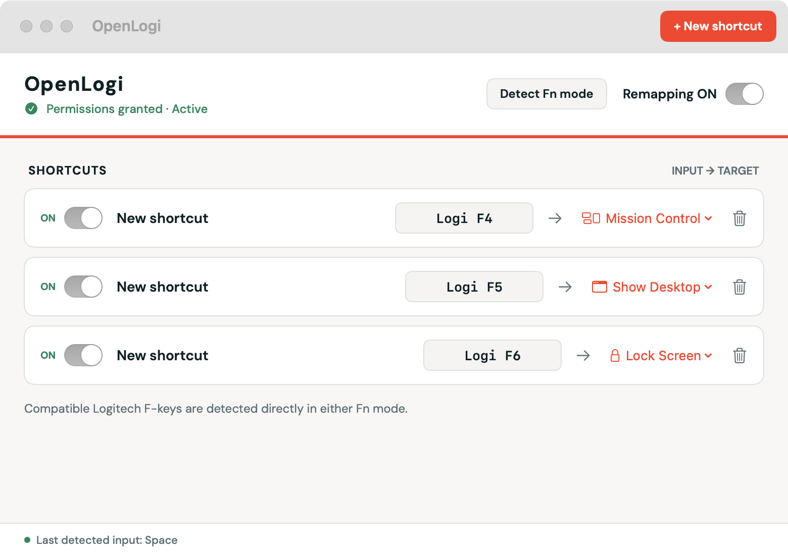

# OpenLogi

OpenLogi is a native macOS menu-bar utility for remapping keyboard shortcuts,
media keys, and compatible Logitech function keys.



> Personal project snapshot. Not a supported product or a prebuilt binary release.

## Highlights

- Record keyboard, media-key, and compatible Logitech function-key input.
- Map inputs to keyboard shortcuts or built-in macOS actions.
- Control HID++ Fn mode on supported Logitech keyboards.
- Optionally launch OpenLogi automatically when you sign in.
- Keep remapping active after closing the main window.
- Store configuration locally, with no network or analytics code.

## Requirements

- macOS 14 or later
- Xcode 16 or later, or the matching Swift toolchain
- Accessibility permission for global event capture and remapping
- Input Monitoring permission for direct Logitech HID++ access

## Build and run

```sh
mise run package
open dist/OpenLogi.app
```

Run tests with:

```sh
mise run test
```

The packaging script creates a local development signing identity in
`.openlogi-signing/`. That directory is ignored and must never be committed.
The resulting app is self-signed for local use and is not notarized for
distribution.

The **Start at Login** toggle uses macOS login-item registration and is
available from the packaged, signed app rather than a `swift run` executable.

## Permissions

OpenLogi needs Accessibility access to observe and remap global keyboard
events. Direct Logitech HID++ features also require Input Monitoring access.

Grant both permissions in **System Settings → Privacy & Security**. Restart
OpenLogi after changing Input Monitoring permission.

## Logitech support

Compatible Logitech F-keys are detected directly in either Fn mode through the
keyboard's HID++ reprogrammable-controls feature. Support depends on the
keyboard exposing that feature; the Logitech vendor ID alone does not guarantee
compatibility.

OpenLogi treats vendor actions such as `Logi F4` separately from standard macOS
function keys such as `Standard F4`.

## Configuration

Shortcut configuration is stored locally at:

```text
~/Library/Application Support/OpenLogi/shortcuts.json
```
